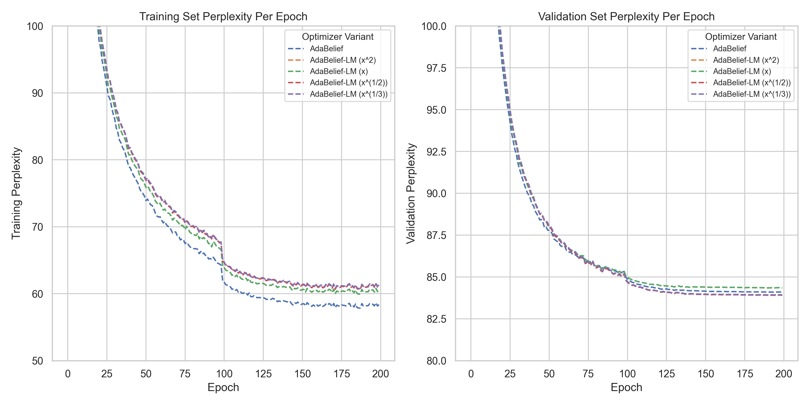
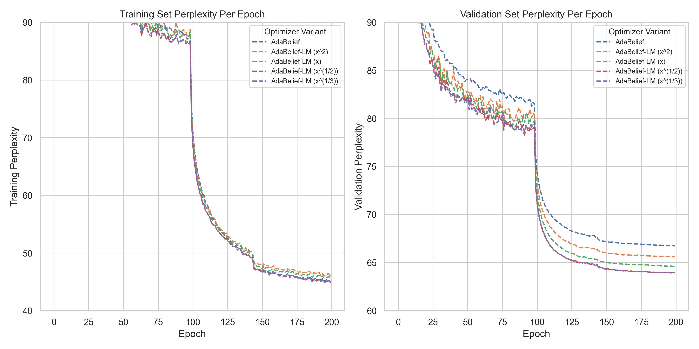
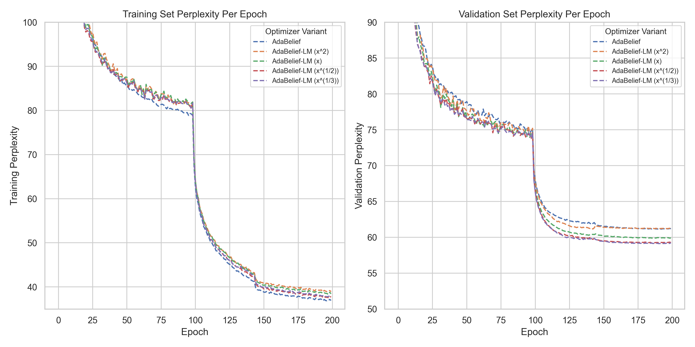

# Improved Adaptive Optimization for Language Modeling

## Yale-NUS MCS Capstone Project 2024. AdaBelief-LM generalizes better than AdaBelief in language modeling.

This is the code repository for the capstone project "Improved Adaptive Optimization for Language Modeling", by Andrew Siow and supervised by Professor Michael Choi. This paper demonstrates the effectiveness of landscape modification in improving validation performance in the domain of language modeling, and extends existing research by suggesting a novel hypothesis that landscape modification biases convergence to flatter minima in deep learning.  

Paper: [Improved Adaptive Optimization for Language Modeling](Andrew_Siow_Capstone_Improved_Adaptive_Optimization_Language_Modeling.pdf)

### Data
The data/ folder contains data for training and validation losses and perplexities for the LSTM experiments. Each row corresponds to an epoch.

### AdaBelief-LM
adabelief_lm.py contains our Pytorch implementation of AdaBelief-LM. To create AdaBelief-LM, we modified the Pytorch source code of AdaBelief by Zhuang et al. Specifically, we modified the 'step' function.  

### Training Code and Usage
train-lstm-adabelief.ipynb trains a LSTM model with AdaBelief, and train-lstm-adabelief-lm.ipynb trains an LSTM model with AdaBelief-LM. For training purposes, please follow the AdaBelief authors' hyperparameters. The Jupyter Notebooks are also optimized for Kaggle.

### Selected Results
The results below were run with random seed 141.
#### 1 Layer LSTMs

#### 2 Layer LSTMs

#### 3 Layer LSTMs

### Acknowledgements
The author of this paper is indebted to the authors of AdaBelief, who not only developed AdaBelief but also ran extensive experiments for LSTM training over Penn TreeBank, thus providing a recommended set of hyperparameters.
[AdaBelief Repository](https://github.com/juntang-zhuang/Adabelief-Optimizer/tree/update_0.2.0 "AdaBelief Repository")

Further acknowledgements can be found in the paper. 

### Contact
Contact the author at `andrewsiow@u.yale-nus.edu.sg`.
